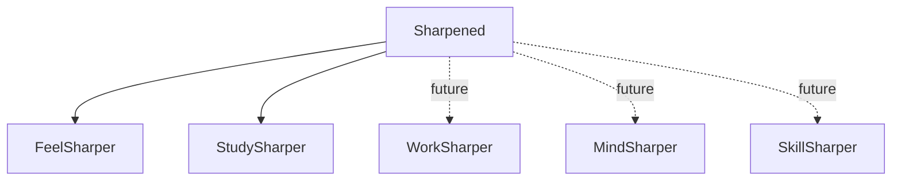

# 02 — Brand Architecture

## Model
- Masterbrand: Sharpened
- Verticals: FeelSharper (Body & Performance), StudySharper (Mind & Learning)
- Future: WorkSharper, MindSharper, SkillSharper

## Naming Rules
- Product naming: <Verb><Sharper> (CamelCase) with single-word verbs (Feel/Study/Work/Mind/Skill).
- Endorsement line: Optional "by Sharpened" where needed (press, app stores).
- Color accents: product-specific; typography shared.

## Taxonomy & IA
- Shared top-level nav pattern; vertical-specific IA underneath.
- Shared auth and dashboard patterns; product modules extend.

## Decision Blocks

### [Decision] Endorsement Line Usage
- Options:
  - A) Always use "by Sharpened" in external PR/app stores.
  - B) Use only in first mention on page.
  - C) Never use; rely on masterbrand context.
- Pros/Cons: A) +Equity; B) +Balance; C) +Brevity/−clarity.
- Recommendation: B.
- STATUS: Proposed
- Owner: TBD
- Due: TBD

### [Decision] Sub-Brand Accent Palette
- Options: A) Red (Feel), Cyan (Study), Amber (Work), Teal (Mind), Green (Skill).
- Pros/Cons: +Distinct; +Accessible with dark UI; verify contrast.
- Recommendation: Keep as specified; adjust if contrast fails.
- STATUS: Proposed
- Owner: TBD
- Due: TBD

## Open Questions
- [ ] Do we reserve more verbs (e.g., CreateSharper) or keep a tight core set?
- [ ] Are product-level logos independent, or colorized variants of the "S" logomark only?
